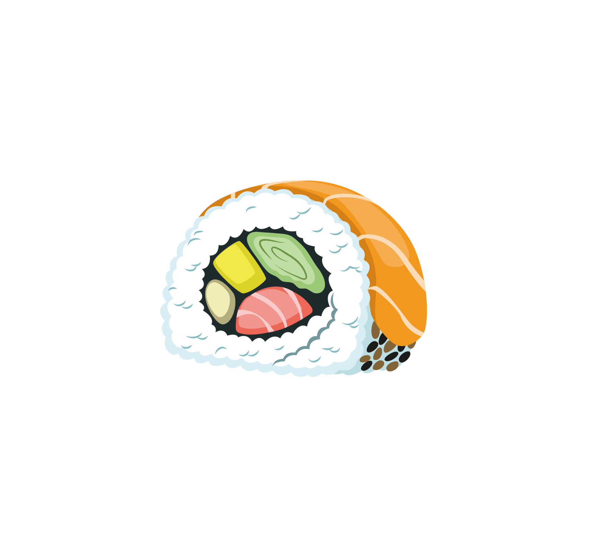

# maki

## What is Maki?

Maki is a personal AI that runs on your own infrastructure. It runs as microservices on Kubernetes, uses NATS for coordination, and Claude for reasoning. It has persistent memory, an idle thinking loop, and a self-healing health monitor.

## Components

Custom services:

- **cortex** — Claude-backed reasoning engine. Thinks on its own when idle.
- **stem** — coordinator. Manages context, conversation history, memory retrieval.
- **ears** — Discord bot. Input/output interface.
- **recall** — long-term memory via Mem0. Stores and retrieves memories automatically.
- **immune** — health monitor with its own Claude instance. Restarts failed pods, tunes its own config.
- **synapse** — OpenAI-compatible LLM proxy so Mem0 can talk to Claude.

Infrastructure:

- **NATS** — messaging, streams, KV state
- **PostgreSQL** + pgvector — vector store for memories
- **Neo4j** — relationship graph for memory
- **Ollama** — local embeddings

## Requirements

- Kubernetes cluster (tested on microk8s)
- Claude API access (via Claude Agent SDK)
- ~8GB RAM for the full stack
- Discord bot token

## License

See [LICENSE](LICENSE).
