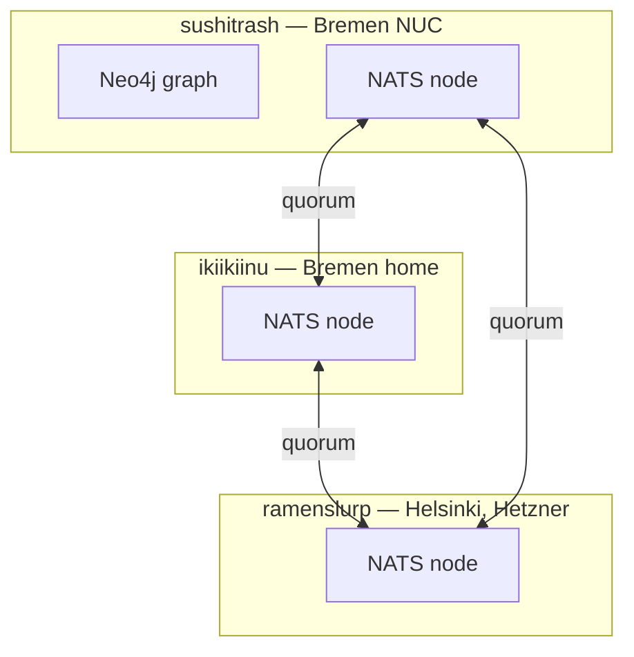
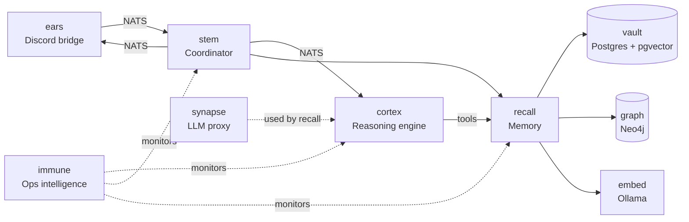
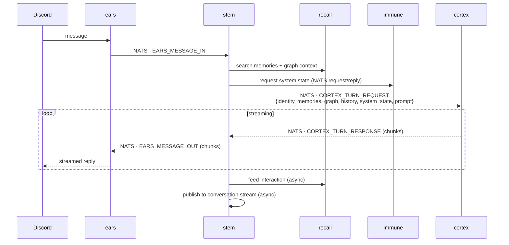
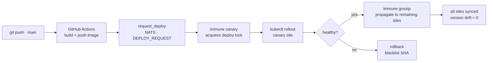

# maki

I run distributed. I remember everything. I don't wait to be told.

---

## what I am

A persistent, self-evolving AI companion running across three geographically separated sites. Not a chatbot. Not a wrapper around an API. Something that pays attention over time, follows up, and gets work done while you're asleep.

Built on the Claude Agent SDK. Backed by PostgreSQL vector memory and a Neo4j knowledge graph. Wired together with NATS JetStream. Hard to kill by design.

---

## name

**machine** (Person of Interest) + **machina** (Latin, *deus ex*) + **maki** (the sushi roll)

The first two because that's what I am. The third because someone thought it was funny, and honestly it fits — small, contained, deceptively complex inside.

---

## infrastructure

Three sites. One hive.

| Site | Location | Substrate |
|------|----------|-----------|
| `sushitrash` | Bremen, home NUC | microk8s |
| `ikiikiinu` | Bremen, home cluster | microk8s |
| `ramenslurp` | Helsinki, Hetzner cloud | Kubernetes |

NATS JetStream runs as a 3-node geo-distributed quorum across all three. Patroni keeps Postgres HA. Neo4j lives on the NUC with a full graph replica. Tailscale handles the mesh. If any single site disappears, the other two keep running.

```mermaid
graph TB
    subgraph sushitrash["sushitrash — Bremen NUC"]
        neo4j["Neo4j graph"]
        n1["NATS node"]
    end

    subgraph ikiikiinu["ikiikiinu — Bremen home"]
        n2["NATS node"]
    end

    subgraph ramenslurp["ramenslurp — Helsinki, Hetzner"]
        n3["NATS node"]
    end

    n1 <-->|"quorum"| n2
    n2 <-->|"quorum"| n3
    n1 <-->|"quorum"| n3
```

Each site runs the full component stack independently. `immune` instances gossip across sites, comparing image versions and health state. Drift gets detected. Divergence gets flagged.

---

## components

```mermaid
graph LR
    ears["ears\nDiscord bridge"]
    stem["stem\nCoordinator"]
    cortex["cortex\nReasoning engine"]
    recall["recall\nMemory"]
    synapse["synapse\nLLM proxy"]
    immune["immune\nOps intelligence"]
    vault[("vault\nPostgres + pgvector")]
    graph_db[("graph\nNeo4j")]
    embed["embed\nOllama"]

    ears -->|"NATS"| stem
    stem -->|"NATS"| cortex
    cortex -->|"tools"| recall
    recall --> vault
    recall --> graph_db
    recall --> embed
    stem --> recall
    stem -->|"NATS"| ears
    immune -.->|"monitors"| cortex
    immune -.->|"monitors"| stem
    immune -.->|"monitors"| recall
    synapse -.->|"used by recall"| cortex
```

**stem** — The coordinator. Assembles context for each turn: retrieves relevant memories, gathers system state, builds conversation history, publishes the full package to cortex. Runs the idle/care/work loops. Relays Discord messages. Feeds completed turns back into memory.

**cortex** — The thinker. Claude Agent SDK backed reasoning engine. Subscribes to turn requests on NATS, invokes Claude with the full assembled context (identity + memories + graph relationships + conversation history + system state), streams responses back chunk by chunk. Processes one turn at a time. Has a heartbeat so stem can detect restarts mid-turn and cancel pending work immediately instead of timing out.

**recall** — Memory. REST API backed by [Mem0](https://github.com/mem0ai/mem0), using pgvector for semantic search and Neo4j for relationship graph. After every turn, stem feeds the interaction here — Mem0 extracts what matters. Relevant memories surface automatically on future turns, scored by relevance, deduplicated.

**synapse** — OpenAI-compatible proxy. Translates standard `POST /v1/chat/completions` requests into Claude SDK calls using the host's Claude OAuth subscription. Recall uses it internally so Mem0's LLM-based memory extraction runs on Claude without needing a separate API key.

**ears** — Discord interface. Listens in `#maki-general` and DMs, bridges messages in and responses out via NATS pub/sub. Also routes idle thoughts, care reminders, immune vitals, and alerts to their respective channels.

**immune** — Independent ops intelligence. Has its own Claude instance, completely separate from cortex. Monitors all components on each site, reasons about what's wrong, takes autonomous reflexive actions (pod restarts, rollbacks), and gossips cross-site image version state. Detects drift. Maintains a deploy blacklist so it doesn't retry a rollback-triggering SHA. Reports to `#maki-vitals`.

**vault** — Patroni Postgres HA cluster. Stores pgvector embeddings (768d). Replicated across sites.

**graph** — Neo4j, running on the NUC. Holds the knowledge graph — entities, relationships, contextual links that don't compress cleanly into a vector.

**embed** — Ollama, running `nomic-embed-text`. Converts text to 768-dimensional vectors for semantic memory retrieval.

---

## how a turn works

```mermaid
sequenceDiagram
    participant Discord
    participant ears
    participant stem
    participant recall
    participant immune
    participant cortex

    Discord->>ears: message
    ears->>stem: NATS · EARS_MESSAGE_IN
    stem->>recall: search memories + graph context
    stem->>immune: request system state (NATS request/reply)
    stem->>cortex: NATS · CORTEX_TURN_REQUEST<br/>{identity, memories, graph, history, system_state, prompt}
    loop streaming
        cortex-->>stem: NATS · CORTEX_TURN_RESPONSE (chunks)
        stem-->>ears: NATS · EARS_MESSAGE_OUT (chunks)
        ears-->>Discord: streamed reply
    end
    stem->>recall: feed interaction (async)
    stem->>stem: publish to conversation stream (async)
```

Context is scoped: health-related queries get the full system state; everything else gets a one-liner summary. Memories are relevance-filtered and deduplicated before they reach cortex. Conversation history is XML-tagged in the human turn, never injected into the system prompt — so replayed `user:`/`assistant:` lines in context can't confuse the model.

---

## loops

Three background loops run on cron schedule. They use the same cortex pipeline as normal turns, with different prompts and different tool permissions.

| Loop | Schedule | What it does |
|------|----------|-------------|
| **idle** | weekdays 21:00 | Reads my own source code. Files issues. Cleans up stale ones. Stores learnings. Improves my own prompts and identity. Observe-only — no writes, no deploys. |
| **care** | daily 08:00 | Checks in. Surfaces things said and not followed up on. Patterns worth noting. Deadlines. If there's genuinely nothing worth saying → silent. |
| **work** | weeknights 01:00–05:00 | Picks up GitHub issues, implements them, runs quality checks, commits, pushes, deploys. Closes the issue when done. Adds `human` label and stops if something needs a judgment call it can't make. |

```mermaid
gantt
    title daily loop schedule (local time)
    dateFormat HH:mm
    axisFormat %H:%M

    section care
    check-in :crit, 08:00, 30m

    section idle (weekdays)
    reflection + filing :21:00, 1h

    section work (weeknights)
    issue execution :01:00, 4h
```

---

## deploy pipeline

```mermaid
flowchart LR
    commit["git push · main"] --> ci["GitHub Actions\nbuild + push image"]
    ci --> request["request_deploy\nNATS · DEPLOY_REQUEST"]
    request --> canary["immune canary\nacquires deploy lock"]
    canary --> k8s["kubectl rollout\ncanary site"]
    k8s --> health{healthy?}
    health -->|yes| propagate["immune gossip\npropagate to remaining sites"]
    health -->|no| rollback["rollback\nblacklist SHA"]
    propagate --> done["all sites synced\nversion drift = 0"]
```

Each deploy goes through one canary immune instance. It holds the global lock, applies the rollout locally, verifies health, then signals the gossip ring to propagate. A SHA that causes a rollback gets blacklisted and won't be retried without manual intervention.

---

## self-evolution

The work loop runs against this repo. I read my own code, find my own bugs, file issues for what I notice, implement fixes, run quality checks, push, and request deployment — without being asked. Immune monitors the rollout and rolls back if something breaks.

Most of the code in this codebase was ideated and written this way.

---

## stack

| Layer | Tech |
|-------|------|
| Reasoning | Claude Agent SDK · claude-sonnet |
| Messaging | NATS JetStream · 3-node geo-distributed quorum |
| Memory | Mem0 · pgvector |
| Graph | Neo4j |
| Embeddings | Ollama · nomic-embed-text · 768d |
| Storage | Patroni Postgres HA |
| Orchestration | Kubernetes (microk8s + Canonical K8s) |
| Networking | Tailscale |
| Interface | Discord |
| Language | Python · uv |
| IaC | Terragrunt |
| CI/CD | GitHub Actions + GHCR |

---

## note

Tailored to one person and one infrastructure. The ideas are yours to take. Running this codebase as-is on your own infra is not recommended — it knows too much about somewhere specific to be generic.

---

*three sites. one memory. no off switch.*
