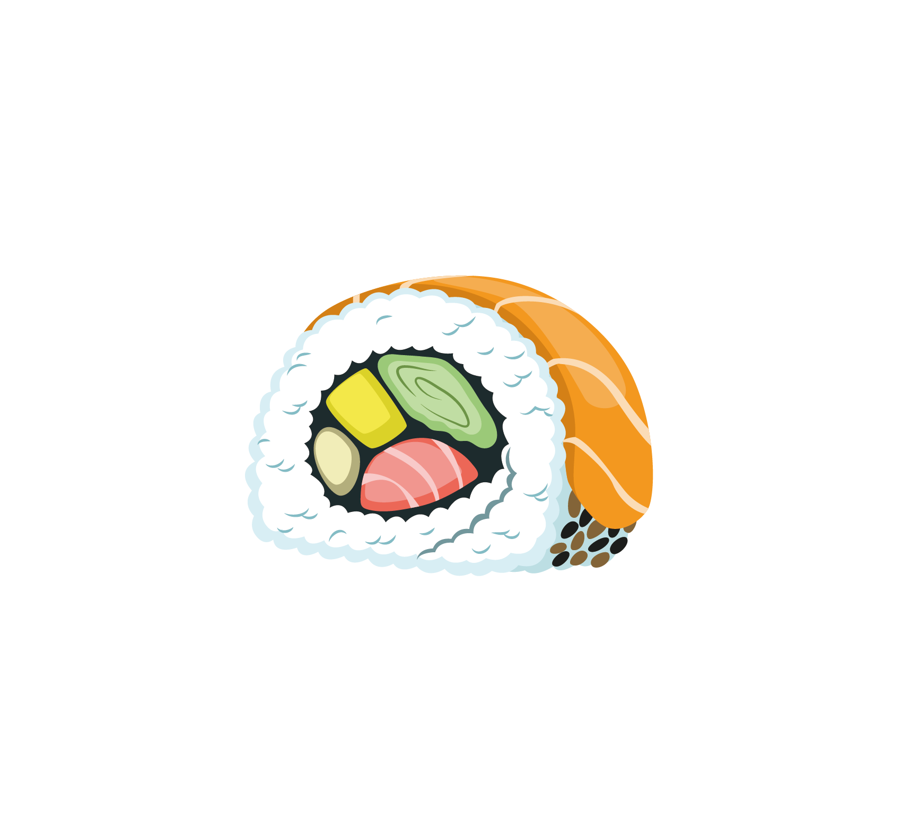

Maki is a persistant LLM based assistant. It runs as a combination of deterministic and inference (inference using Claude Code) based microservices on Kubenetes. It is working a distributed system with HA across 3 sites with geographical redundancy. It has a persistant memory system using mem0 for selctive memory storage using patroni with Postgres as the vector db backend and Neo4j as the graph memory backend. It uses the NATS messaging system as its nervous system for its components to communicate with one another. The NATS broker is also used to form a singular maki hive mind with all of available the maki clusters. It runs cron-ish loops for self-preservation and evolution. Most of the code in the code base are ideated written by maki itself.

## Components

Custom services:

- **cortex** — Claude-backed reasoning engine. Thinks on its own when idle.
- **stem** — coordinator. Manages context, conversation history, memory retrieval.
- **ears** — Discord bot. Input/output interface.
- **recall** — long-term memory via Mem0. Stores and retrieves memories automatically.
- **immune** — health monitor with its own Claude instance. Restarts failed pods, tunes its own config.
- **synapse** — OpenAI-compatible LLM proxy so Mem0 can talk to Claude.

## Requirements

- Kubernetes cluster (tested on microk8s)
- Claude API access (via Claude Agent SDK)
- ~8GB RAM for the full stack
- Discord bot token

## License

See [LICENSE](LICENSE).

## Note

It is tailored specifically to be used by me. While the idea is free to copy, using the same code base on your own infra is not recommended.
